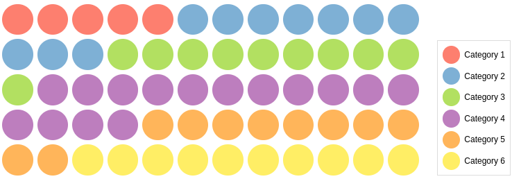

# React Dot Matrix Chart

<a href="https://www.npmjs.com/package/@keyvaluesystems/react-dot-matrix-chart"></a> <a href="https://www.npmjs.com/package/@keyvaluesystems/react-dot-matrix-chart" ></a> <a href="https://github.com/KeyValueSoftwareSystems/react-dot-matrix-chart"></a>

<div align="center">

</div>

> A customizable ready to use Dot Matrix Chart Component for React

Try tweaking a dot matrix using this codesandbox link <a href="https://codesandbox.io/s/dot-matrix-chart-hqw9z0" >here</a>

## Installation

The easiest way to use react-dot-matrix-chart is to install it from npm and build it into your app with Webpack.

```bash
npm install @keyvaluesystems/react-dot-matrix-chart
```

You’ll need to install React separately since it isn't included in the package.

## Usage

React Dot Matrix Chart can run in a very basic mode by just providing the `dataPoints` like given below:

```jsx
import DotMatrix from "@keyvaluesystems/react-dot-matrix-chart";

<DotMatrix dataPoints={dataPointsArray} />;
```

The datapoints is an array of objects with the following keys:

- `name` - a string that represents each category
- `count` - a number to specify the count of each category present(used to find the number of dots to be displayed)
- `color` - a string to specify which colour to be used to represent the category in the dot matrix

An example for dataPoints array is shown below:

```jsx
const dataPointsArray = [
  {
    name: "Category 1",
    count: 10,
    color: "gray"
  },
  {
    name: "Category 2",
    count: 10,
    color: "black"
  },
  {
    name: "Category 3",
    count: 10,
    color: "green"
  },
];
```

You can specify the number of rows or columns to be present in the chart as well using the dimensions prop.

```jsx
<DotMatrix
  dataPoints={dataPointsArray}
  dimensions={{
    rows: 5,
    columns: 10
  }}
/>
```

If the count given in the dataPoints array results in a partial percentage (decimal value), a gradient dot will be displayed as shown below

<div  align="center">

</div>

We can also control the display of the legend consisting of the details regarding the colour distribution using the props 'showLegend' and 'legendPosition' as follows.

```jsx
<DotMatrix
  dataPoints={dataPointsArray}
  showLegend={true}
  legendPosition="top"
/>
```

## Props

Props that can be passed to the component are listed below:

<table>
  <thead>
    <tr>
      <th>Prop</th>
      <th>Description</th>
      <th>Default</th>
    </tr>
  </thead>
  <tbody>
    <tr>
      <td><code><b>dataPoints:</b> object[]</code></td>
      <td>
      An array of category objects to specifying the count and name of each section
      </td>
      <td><code>undefined</code></td>
    </tr>
    <tr>
      <td><code><b>dimensions?:</b> object</code></td>
      <td>
      To specify the number of rows and columns to be present in the chart
      </td>
      <td><code>{ rows: 5, columns: 12 }</code></td>
    </tr>
    <tr>
      <td><code><b>spaceBetweenDots?:</b> number</code></td>
      <td>
         To specify the distance between each dot
      </td>
      <td><code>4</code></td>
    </tr>
    <tr>
      <td><code><b>showLegend?:</b> boolean</code></td>
      <td>
        To specify whether to show the legend or not
      </td>
      <td><code>false</code></td>
    </tr>
    <tr>
      <td><code><b>legendPosition?:</b> 'left' | 'left-start' | 'left-end | 'right' | 'right-start' | 'right-end' | 'top'| 'top-start' | 'top-bottom' | 'bottom' | 'bottom-start' | 'bottom-end' </code></td>
      <td>
        To specify the position of the legend.
      </td>
      <td><code>right-end</code></td>
    </tr>
      <tr>
      <td><code><b>styles?:</b> object</code></td>
      <td>
      Provides you with a bunch of callback functions to override the default styles.
      </td>
      <td><code>undefined</code></td>
    </tr>
  </tbody>
</table>

## Style Customizations

All the default styles provided by this package are overridable using the `styles` prop.
the below code shows all the overridable styles:

```jsx
<DotMatrix
  dataPoints={dataPointsArray}
  styles={{
    Container: () => ({ ...styles }),
    DotsContainer: () => ({ ...styles }),
    Dot: () => ({ ...styles }),
    LegendContainer: () => ({ ...styles }),
    LegendName: () => ({ ...styles }),
    LegendDot: () => ({ ...styles }),
  }}
/>
```

- `Container` - overrides the dot matrix chart container style
- `DotsContainer` - overrides the dot matrix chart dots container style
- `Dot` - overrides the style of each dot in the chart
- `LegendContainer` - overrides the legend (details) container style
- `LegendName` - overrides the legend name style
- `LegendDot` - overrides the legend dot style
